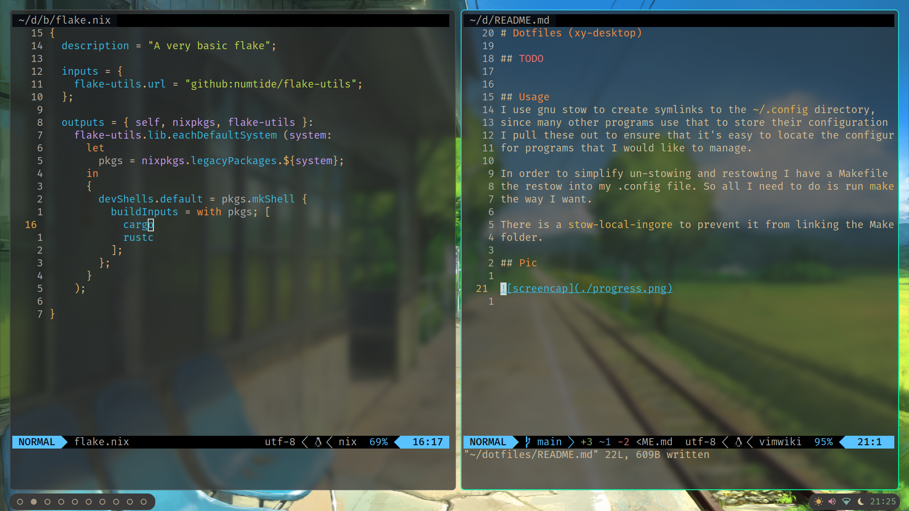

# Dotfiles (xy-desktop)

This project contains all the dotfiles for various programs I use,
additionally contains [Eww Widgets](https://github.com/elkowar/eww) that I have made for the desktop.

## TODO
- [ ] Nix Compatibility
- [ ] BrightnessCtl integration
- [ ] CPU/MEM/Disk Usage
- [ ] power management overlay
- [ ] pywal support

## Usage 
I use gnu stow to create symlinks to the `~/.config` directory, 
since many other programs use that to store their configuration
I pull these out to ensure that it's easy to locate the configurations
for programs that I would like to manage.

In order to simplify un-stowing and restowing I have a Makefile that just runs
the restow into my .config file. So all I need to do is run `make` to link everything
the way I want.

There is a `stow-local-ingore` to prevent it from linking the Makefile into the `~/.config`
folder.

## Pic

